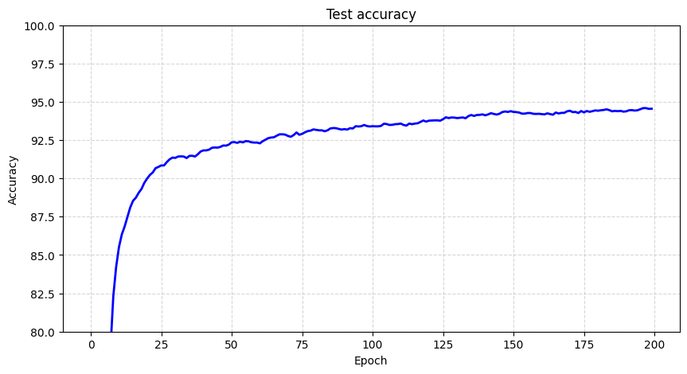
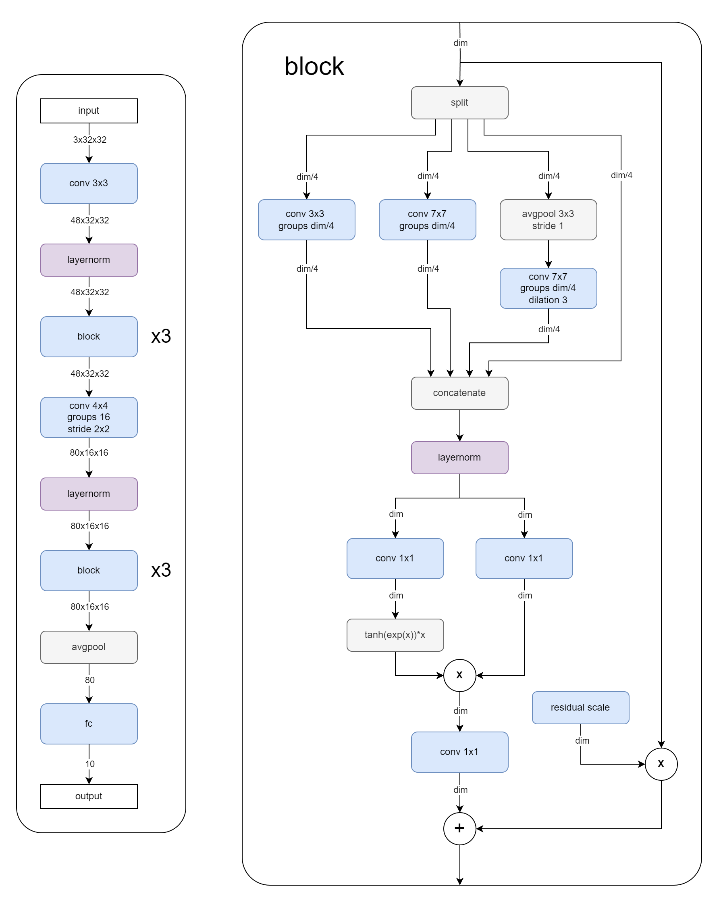

# Tiniest Convolutional Network for CIFAR-10 Dataset with human-level performance

The model has 97530 trainable parameters and achieves 94.4% test set accuracy (5 run average)  

## Architecture

## Training setup

AdamW optimizer, BS=256, cosine warmup 2 epochs to lr=0.02, cosine decay 198 epochs to lr=0.002, EMA with decay=0.999 as final model.

Augmentations:  
random horizontal flip  
random crop ±4px  
random rotation ±15deg  
random sharpening  
random color jiggle  
mixup with linearly increasing intensity for the first 100 epochs  

Code is minimal and self-explanatory
